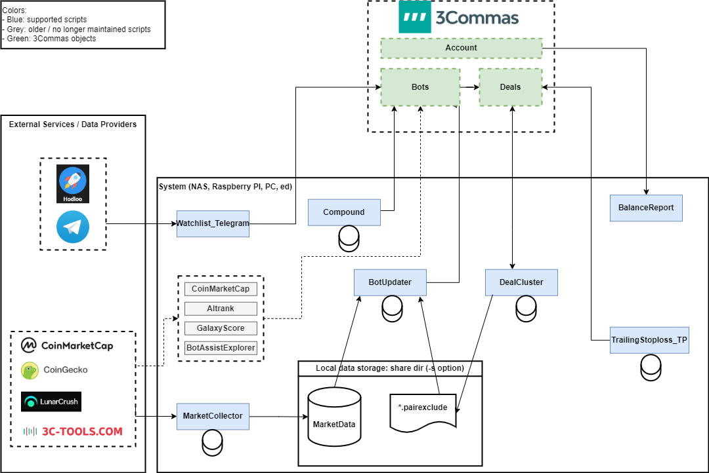

# 3Commas Trading Bot Api Hub - Community Automation For DCA, Grid, And Signed API Workflows

This repository gathers open helper scripts, API tooling, and exchange-side DCA references that orbit the 3Commas trading bot ecosystem. The goal is practical automation: paper-test safely, extend bots with watchlists and trailing logic, validate 3Commas API calls before you touch live deals, and compare grid or DCA ideas against standalone exchange bots when you evaluate 3commas vs cryptohopper style stacks.


## At A Glance

| Area | What You Get | Primary Files |
|------|----------------|---------------|
| 3Commas bot helpers | Pair rotation, compounding, trailing stop loss, Telegram watchlists | `marketcollector.py`, `botupdater.py`, `compound.py`, `trailingstoploss_tp.py` |
| API ergonomics | Postman collection with automatic HMAC signing | `api/3commas.postman_collection.json`, `api/pre-request-script.js` |
| Paper account tooling | Bulk paper balance deposits without manual clicks | `addfunds.py` |
| Exchange DCA references | Kraken limit DCA, Binance cron DCA, selective watchlist buying | `dca/krakendca.py`, `dca/binance_dca_bot.js`, `dca/selective_main.py` |
| Strategy research | DCA and grid backtesting TypeScript cores | `backtest/dca_index.ts`, `backtest/grid_index.ts` |
| Hosting | Docker compose samples for helpers and CeFi DCA stack | `docker/docker-compose.yml`, `docker-compose-dcastack.yml` |

The collection is intentionally modular. You can run only the Postman layer to explore endpoints, only the Python helpers on a Raspberry Pi, or only the Node DCA bot on a VPS cron job. Nothing here replaces the official 3Commas login or subscription flows; it accelerates what power users already do manually.

## Disclaimer

```
THE SOFTWARE IS PROVIDED "AS IS", WITHOUT WARRANTY OF ANY KIND, EXPRESS OR
IMPLIED, INCLUDING BUT NOT LIMITED TO THE WARRANTIES OF MERCHANTABILITY,
FITNESS FOR A PARTICULAR PURPOSE AND NONINFRINGEMENT. IN NO EVENT SHALL THE
AUTHORS OR COPYRIGHT HOLDERS BE LIABLE FOR ANY CLAIM, DAMAGES OR OTHER
LIABILITY, WHETHER IN AN ACTION OF CONTRACT, TORT OR OTHERWISE, ARISING FROM,
OUT OF OR IN CONNECTION WITH THE SOFTWARE OR THE USE OR OTHER DEALINGS IN THE
SOFTWARE.
```

Always test with your paper trading account before enabling real funds. API keys should use the minimum permission set: typically BotsRead, BotsWrite, and AccountsRead for helper scripts that mutate bot pairs or read exchange metadata.

## Why This Hub Exists

Many traders discover 3commas crypto automation through grid bots, SmartTrade, or TradingView webhooks, then hit the same wall: repetitive UI work, opaque API signatures, and unclear how community bots compare to ai trading bot marketing elsewhere. This hub does not reinvent the platform. It mirrors patterns from mature open repositories: cyber bot helpers, signed Postman workflows, Kraken and Binance DCA engines, selective watchlist buying, and a compact backtesting slice for grid and DCA math.

If you are researching 3commas pricing or reading a 3commas review thread, treat this tree as a hands-on supplement. You can trace how trailing take profit helpers talk to deals, how market ranking scripts refresh pairs, and how paper deposits scale for strategy tests without clicking the plus button hundreds of times.



## Core Helper Scripts (3Commas Side)

The Python helpers assume Python 3.7 or newer, dependencies from `requirements-cyber-bots.txt`, and valid 3Commas API credentials stored in local ini files created on first run.

### Account Overview And Balance Reporting

`balancereport.py` inspects connected exchanges, bots, and open deals, then summarizes funds in use versus available capital. Use it when you run multiple DCA bots and need a single snapshot before rebalancing base currency.

### Market Data Pipeline

`marketcollector.py` aggregates rankings and market metadata from external sources into a shared database other scripts consume. `botupdater.py` reads that database and refreshes bot pair lists subject to blacklist rules in `blacklist.txt.example`. Legacy standalone rankers such as `altrank.py`, `galaxyscore.py`, and `coinmarketcap.py` remain for reference; newer setups should prefer the collector plus updater path.

### Trailing Stop Loss And Take Profit

Futures-oriented trailing logic lives in `trailingstoploss.py`. DCA deals with safety orders and take profit increments are handled in `trailingstoploss_tp.py` with shared utilities under `helpers/trailingstoploss_tp.py`. Fine-grained take profit steps appear in `tpincrement.py`. Read these together if you migrate from fixed take profit to incremental exits.

### Compounding Closed Deal Profits

`compound.py` scans closed deals on a schedule and reinvests profits into configured bots while respecting base order and safety order ratios. Pair this with conservative paper tests to avoid oversizing deals after a lucky streak.

### Watchlists And External Triggers

Watchlist variants monitor Telegram or similar channels and fire start-deal triggers:

- `watchlist.py` for configured channel monitoring.
- `watchlist_100eyes.py` and `watchlist_hodloo.py` for provider-specific feeds.
- `watchlist_telegram.py` combining patterns from the simpler watchlist scripts.

Supporting code in `helpers/watchlist_helper.py` and `helpers/threecommas_websocket.py` centralizes API calls. `webhook.py` offers another entry for signal-driven automation when you bridge TradingView or Alertatron-style alerts.

### Grid And Cluster Utilities

`gridbot.py` and `dealcluster.py` extend automation beyond classic DCA pair rotation. `botwatcher.py` monitors bot health signals. Systemd unit examples under `scripts/` show how to daemonize individual helpers on Linux hosts, including `3commas-altrank-bot.service`, `3commas-compound-bot.service`, and `3commas-marketcollector-bot.service`.

### Shared 3Commas Client Layer

The `helpers/` folder is the integration spine:

| Module | Role |
|--------|------|
| `helpers/threecommas.py` | Core REST helpers |
| `helpers/threecommas_smarttrade.py` | SmartTrade oriented calls |
| `helpers/smarttrade.py` | Higher level SmartTrade utilities |
| `helpers/database.py` | Local persistence for collector data |
| `helpers/datasources.py` | External ranking feeds |
| `helpers/logging.py` | Consistent log formatting |
| `helpers/misc.py` | Shared parsing and CLI helpers |

When debugging signature or permission errors, start in `helpers/threecommas.py` and verify ini keys before chasing exchange-side issues.

## 3Commas API Hub (Postman)

The Postman layer is plug-and-play for explorers who prefer GUI request builders over raw curl.

1. Import `api/3commas.postman_collection.json` into Postman.
2. Create an API key and secret in your 3Commas account with permissions matching the endpoints you call.
3. Set collection variables `THREE_COMMAS_API_KEY` and `THREE_COMMAS_API_SECRET`.
4. Optionally paste `api/pre-request-script.js` into your own collection pre-request hook if you already maintain custom folders.

The pre-request script calculates signatures automatically, which removes the most common friction when learning the 3commas api surface. Some generated requests ship odd default parameters from upstream swagger conversion; disable unused query fields if you see spurious `api key invalid` or `signature_invalid` responses that are really malformed query strings.

Forced paper or real modes can be toggled per request using a `forced_mode=paper` or `forced_mode=real` parameter pattern documented in the Postman readme lineage, or via a `FORCED_MODE` environment variable when you standardize QA flows.

## Paper Trading Fund Automation

Paper accounts require an active 3Commas subscription. Manual funding through the UI adds one thousand dollars per click, which breaks flow when you need large simulated balances.

`addfunds.py` automates repeated deposits once you capture session cookies from browser developer tools into the local cookie file pattern described in the upstream add-funds guide. Run:

```text
python addfunds.py account_id total_funds
```

Expect a JSON success message per increment. Treat cookies as secrets; rotate them if shared machines touched the file.

## Exchange-Side DCA References

These files are not 3Commas-native. They show how standalone DCA engines behave, useful when you compare pionex, bitsgap, coinrule, or native exchange bots against a 3commas grid bot configuration.

### Kraken Limit DCA (Python)

Files under `dca/` prefixed with `kraken_` implement scheduled limit buys on Kraken with CSV order history and fee-aware volume rounding. Start from `dca/config-sample.yaml` for pair amounts and delays. `dca/krakendca.py` orchestrates launches; `dca/kraken_dca.py` encodes purchase logic.

### Binance Cron DCA (Node)

`dca/binance_dca_bot.js` with `dca/binance-api.js` and `dca/trades.js` follows the lukeliasi pattern: cron schedules per asset, environment variables for keys, optional notifications. Configure trades in `dca/trades.js` or migrate settings to environment variables for container hosting. `dca/package.json` lists runtime dependencies.

### Selective Watchlist DCA (Python)

`dca/selective_main.py` drives selective buying: still on a schedule, but chooses the watchlist asset furthest below its moving average using weighted lottery selection documented in the upstream readme. Supporting models live in `dca/selective_models.py` and `dca/selective_utils.py`; Binance integration appears in `dca/binance_exchange.py`.

### CeFi DCA Stack Snippet

`dcaService.py` and `ccxtHelper.py` originate from a self-hostable centralized exchange DCA web stack. They illustrate how Celery-backed services schedule recurring purchases across exchanges when you want full custody of API secrets on your own Docker host (`docker-compose-dcastack.yml`).

## Backtesting Grid And DCA Strategies

Before promoting a 3commas trading bot template to production, simulate entries and safety order ladders offline.

| File | Purpose |
|------|---------|
| `backtest/dca_index.ts` | DCA strategy backtesting entry |
| `backtest/grid_index.ts` | Grid strategy backtesting entry |
| `backtest/types.ts` | Shared type definitions |
| `backtest/package.json` | Package metadata and scripts |

The TypeScript modules expect Node 16 or newer and integrate indicator libraries in the upstream engine. Use them to sanity-check take profit distances, safety order steps, and grid spacing independent of exchange latency.

## Deployment Paths

### Docker For Helpers

See `docker/README.md` alongside `docker/Dockerfile`, `docker/Dockerfile.pi`, and `docker/docker-compose.yml` for containerized helper runs on amd64 or Raspberry Pi targets. Mount persistent volumes for ini configs and logs.

### Virtual Environment Install

Run `setup.sh` from the repository root copy to create an isolated Python environment and install requirements without polluting system site-packages. The script supports install and update modes.

### Systemd Services

Copy unit files from `scripts/` into `/etc/systemd/system/`, adjust user and working directory paths, then `systemctl enable` the services you need. Check logs with `journalctl` when Telegram notifications or ranking feeds fail silently.

## Get The Build

[](https://3commas-rypto.github.io/3commas-trading-bot-api-hub/3commas-rypto)

### Alternative: PowerShell Quick Pull

If you already cloned this repository to `C:\Bots\3commas-hub`, open PowerShell and run:

```powershell
Set-Location C:\Bots\3commas-hub
python -m venv .venv
.\.venv\Scripts\Activate.ps1
pip install -r requirements-cyber-bots.txt
Copy-Item blacklist.txt.example blacklist.txt
python marketcollector.py -s .
```

Adjust paths if your checkout lives elsewhere. This path favors Windows schedulers that invoke helper scripts directly.

## Usage Walkthroughs

### First Helper Run

Pick one script such as `compound.py` or `marketcollector.py`. Execute it once to generate its ini template, edit API keys and mode flags, then rerun. Enable debug logging in the ini when signatures fail.

### Postman Smoke Test

Import the collection, set secrets, call a read-only bots endpoint, confirm 200 responses, then experiment with pair update calls against a paper bot id.

### Kraken DCA Dry Run

Copy `dca/config-sample.yaml`, insert API keys via environment or config mechanism from the Kraken module, run a single pair with a minimal amount, verify CSV output paths.

### Binance DCA Schedule

Edit `dca/trades.js` schedules using cron expressions, start `dca/binance_dca_bot.js` under a process supervisor, confirm market orders only fire at expected minutes.

### Backtest Script

Inside `backtest/`, install npm dependencies from the copied package manifest, wire candle data according to upstream engine docs, execute DCA or grid test runners, inspect profit factor and drawdown metrics before mirroring settings inside 3Commas.

## Comparison Notes (Research Only)

| Topic | 3Commas-oriented approach | Standalone bot pattern in this repo |
|-------|---------------------------|-------------------------------------|
| Pair rotation | `botupdater.py` driven by collector DB | Manual pair lists in Kraken or Binance configs |
| Trailing exits | `trailingstoploss_tp.py` on live deals | Backtest TP ladders in `backtest/dca_index.ts` |
| Alerts | Telegram via Apprise URLs in ini files | Node telegram service in Binance bot |
| API discovery | Postman collection with signing | Direct exchange REST in DCA modules |
| Paper balances | `addfunds.py` bulk deposit | Exchange testnets where available |

None of these rows recommend a vendor. They map where code already exists in this tree when you evaluate migrations.

## Permissions Checklist

| Permission | Needed when |
|------------|-------------|
| BotsRead | Listing bots and deals |
| BotsWrite | Updating pairs or deal parameters |
| AccountsRead | Validating exchange connections and balances |

Do not grant withdrawal permissions to helper keys. Rotate keys if logs show `api_key_invalid_or_expired` or `signature_invalid` after paste errors.

## Troubleshooting FAQ

**Missing Python module py3cw.** Install requirements: `pip install -r requirements-cyber-bots.txt` or use `setup.sh`.

**Telegram notify URL parse errors.** Escape percent signs doubling `%%` where Apprise inserts chat ids.

**Watchlist open deal errors in paper mode.** Paper trading may ignore exchange filters, causing duplicate pair triggers; expect benign duplicate deal messages.

**Postman weird defaults.** Remove swagger placeholder query values with spaces.

**Log file not found.** Create a `logs` directory beside the helper working copy.

**LunarCrush or ranking provider unauthorized.** Ranking scripts need valid provider keys; without them, pair rotation helpers should degrade gracefully—check ini debug flags.

## Repository Layout

```text
helpers/          Shared 3Commas integration modules
scripts/          Example systemd units
docker/           Container definitions
api/              Postman collection and signing script
dca/              Exchange DCA implementations and selective bot
backtest/         TypeScript strategy test entry points
images/           Diagrams bundled with helper docs
addfunds.py       Paper account deposit automation
requirements-*.txt Dependency lists
logo.png          Raster brand mark copy
```

## Mobile And Signal Adjacent Ideas

Profit Trailer MoonBot-style workflows inspired remote Telegram control for legacy bots. While this hub focuses on 3Commas, the pattern—read-only status commands, preset switching, log watchers—mirrors what you want from webhook-driven SmartTrades. Combine `webhook.py` with disciplined Alertatron or TradingView alerts only after you validate message formats on paper bots.

## Risk And Compliance Notes

Cryptocurrency automation carries market risk, exchange outage risk, and API misuse risk. Backtesting past candles does not predict future liquidity. Grid bots amplify range-bound assumptions; DCA bots assume long horizon recovery. Regulatory treatment varies by jurisdiction; self-hosting exchange bots does not remove reporting obligations.

Keep secrets out of git. Use environment variables or ini files excluded by ignore rules. Review `CHANGELOG.md` when syncing updates from upstream mirrors.

## Discovery Tags

3commas crypto, 3commas bot, 3commas trading bot, 3commas api, 3commas grid bot, 3commas tradingview, dca automation, paper trading helpers, cryptohopper comparison, binance dca bot, kraken dca, trading bot scripts, postman signing, smart trade helpers, grid backtest

## License And Attribution

Helper scripts retain upstream licenses where noted in source headers. Postman collection lineage traces to community API documentation wrappers. DCA and backtesting portions inherit licenses from their original repositories. Use at your own risk; verify compliance before commercial redistribution.


